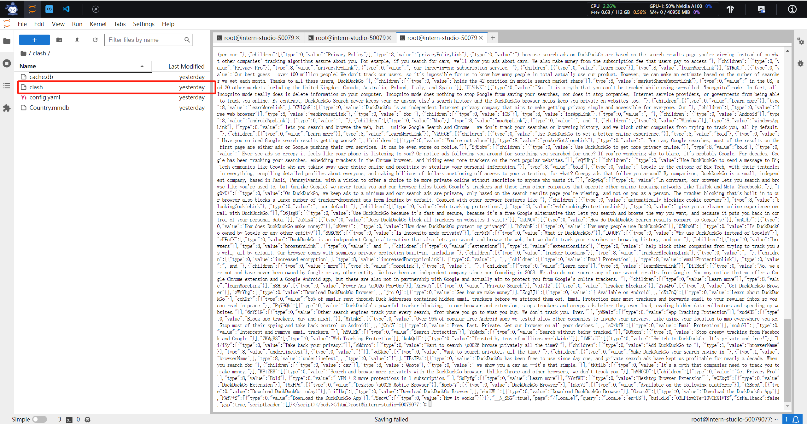
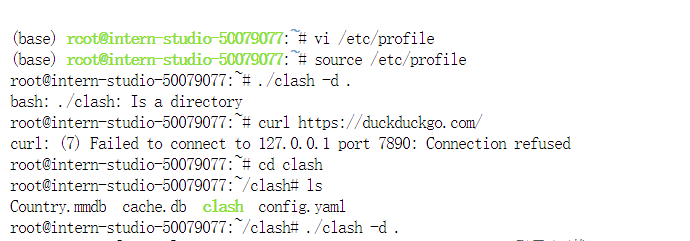
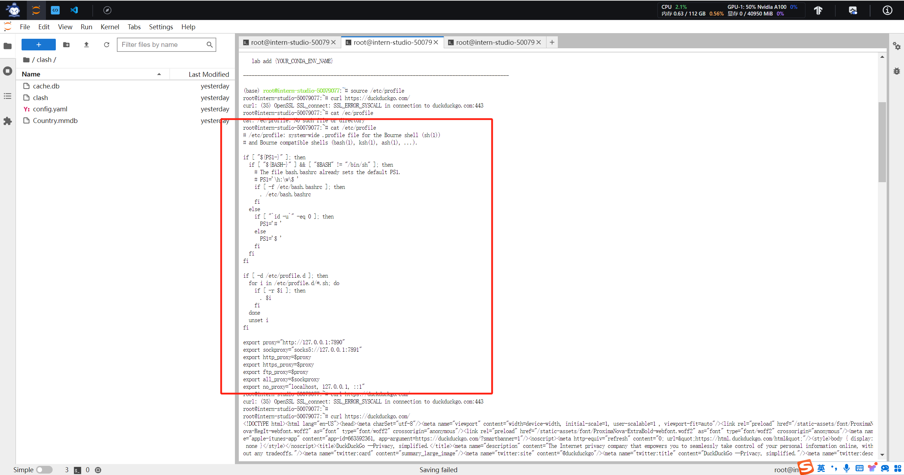
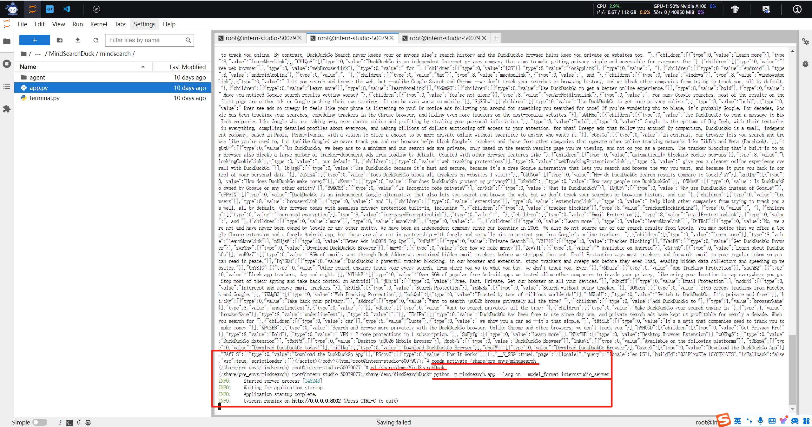
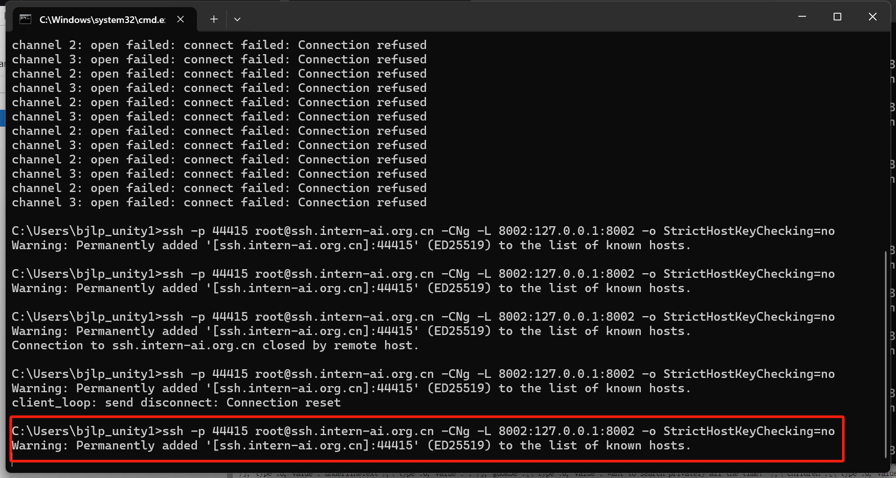
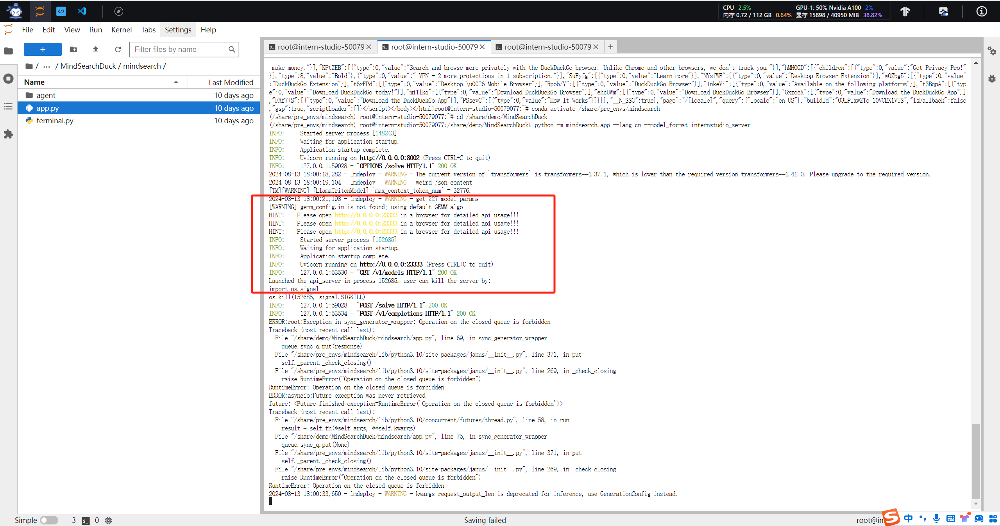
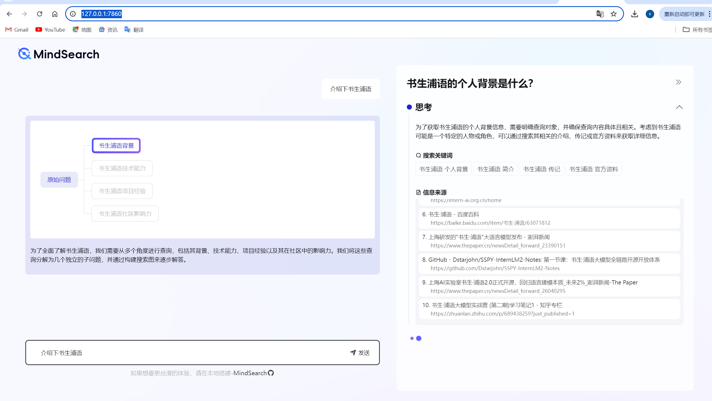

# MindSearch 快速部署（InternStudio 版）

书生浦语官网：https://internlm.intern-ai.org.cn/

## 首先简单了解下MindSearch？

我们模仿人类思维引出深度人工智能搜索，MindSearch 是一个开源的 AI 搜索引擎框架，具有 Perplexity.ai Pro 的性能。您可以使用闭源 LLM（GPT、Claude）或开源 LLM（InternLM2.5-7b-chat）将其与您自己的 perplexity.ai 风格的搜索引擎一起部署。它具有以下特点：

- 🤔**询问您想知道的一切**：MindSearch 旨在解决您生活中的任何问题并使用网络知识。
- 📚**深入的知识发现**：MindSearch 浏览数百个网页来回答您的问题，提供更深入、更广泛的知识库答案。
- 🔍**详细的解决方案路径**：MindSearch 公开所有细节，让用户可以检查他们想要的一切。这大大提高了其最终响应的可信度和可用性。
- 💻**优化的 UI 体验**：为用户提供各种类型的界面，包括 React、Gradio、Streamlit 和 Terminal。根据需要选择任意类型。
- 🧠**动态图构建过程**：MindSearch 将用户查询分解为原子子问题作为图中的节点，并根据 WebSearcher 的搜索结果逐步扩展图。

MindSearch和其他的AI搜索引擎比较（Chat-Web和Perplexity.ai（Pro）），从深度、广度、真实性几个维度来比较，根据 100 个人造真实问题得出的，并由 5 名人类专家评估发现MindSearch均高于另外两个（**所有实验均在 2024 年 7 月 7 日之前完成**）

## 笔记

我们首先解决MindSearch需要的Search API的key的问题，因为这里AI搜索是用到了第三方搜索引擎bing和DuckduckGo，bing在国内是可以访问但是需要 key 需要再微软bing官方网，所以需要自己去微软创建一下必应搜索引擎的key（需要visa卡，这里我没办理该海外visa卡），所以我选择使用DuckduckGo搜索引擎，需要在开发机配置一下代理。详细代理配置，建议github自行查找一下，这里主要讲一下方法，在服务器上安装好clash。



我们先来搭建一下环境：

```python
vi /etc/profile
# 在上述文件中添加如下
export proxy="http://127.0.0.1:7890"
export sockproxy="socks5://127.0.0.1:7891"
export http_proxy=$proxy
export https_proxy=$proxy
export ftp_proxy=$proxy
export all_proxy=$sockproxy
export no_proxy="localhost, 127.0.0.1, ::1"

# 查看是否添加成功
cat /etc/profile
```






编写好profile 退出，使profile 生效，使用如下命令

```python
source /etc/profile
# 测试代理是否生效
curl https://duckduckgo.com/
```

这里我这边是验证通过的，接下来继续根据官方教程启动后端服务，**这里尤其需要注意的时候**，我们的开发机是Docker镜像分配的，我们每开启一个terminal终端就需要执行`source /etc/profile`，然后建议继续测试下代理是否生效，确认生效后方可进行下一步操作，就是启动MindSearch后端服务和前端服务。

```python
# 启动后端
conda activate /share/pre_envs/mindsearch
cd /share/demo/MindSearchDuck
python -m mindsearch.app --lang cn --model_format internstudio_server
# 启动前端
conda activate /share/pre_envs/mindsearch
cd /share/demo/MindSearchDuck
python run.py
```



接下来就是本地端口映射这两个服务了。打win+r，然后输入cmd进到本地终端，输入`ssh -p 44415 root@ssh.intern-ai.org.cn -CNg -L 8002:127.0.0.1:8002 -o StrictHostKeyChecking=no`就可映射后端服务了，注意的是44415是我intern studio开发机的端口号，这里替换成你的端口即可，前端也是需要映射的，再开一个终端，映射7860端口。



部署完成后，我们可以直接本地访问http://127.0.0.1:7860/，这时候我们查看后端服务那里，就能看到我们的模型加载完成，整个流程就是后端程序已经在调用`duckduckgo_search` 这个程序进行联网搜索了。后面通过书生浦语 lagent  框架返回结果，最后在通过`internlm2_5-7b-chat`模型推理将搜索信息总结归纳返回给前端。测试结果如下：






### 总结

这节是MindSearch彩蛋内容，本质上，很简单的，官方也提供好配置好的虚拟环境，但是这个AI搜索可能有一些issue出现，需要小伙伴自己去官方github提，因为我在搭建的时候频繁遇到一个问题，就是`ERROR:root:Exception in sync_generator_wrapper: Operation on the closed queue is forbidden`，这个error主要是janus库在实现异步队列的时候，继续往队列中添加元素，但是这时候队列已经被关闭了。由于我们不能直接修改`share/demo/MindSearchDuck/mindsearch/app.py`，所以暂时我没有解决，但是我建议在队列添加元素代码段，先检查队列关闭状态，sync_generator_wrapper()方法中可以添加个if，然后将异常处理和报错日志也可以优化下，方便我们更好的排查问题，**`async_generator_wrapper`**中添加try...finally确保队列关闭，这样确保代码更容易调试和可维护。谢谢小伙伴看到这里，我们下个精彩内容见~